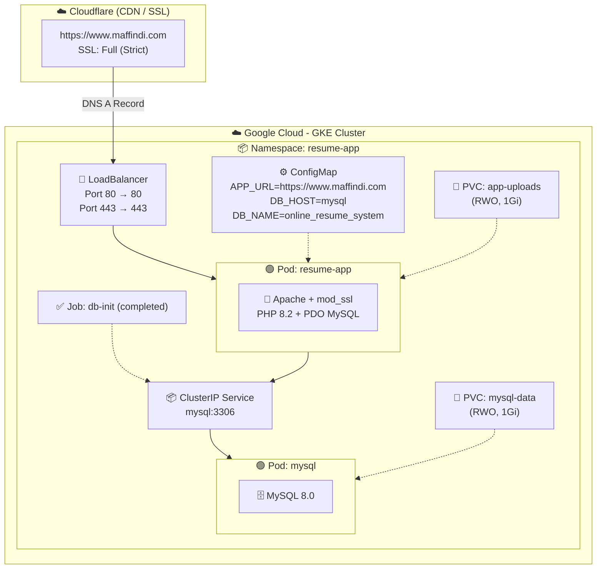

# Online Resume System

A modern, responsive web application for creating and managing professional online resumes. Built with PHP, MySQL, and vanilla JavaScript.

## Features

### Public Resume
- Clean, professional landing page design
- Dynamic stats display (Experience, Education, Skills, Certifications, Projects)
- Professional summary section
- Contact information with clickable links (Email, Phone, LinkedIn, GitHub)
- Printable PDF resume view

### Admin Dashboard
- Secure authentication system
- **Profile Management**: Personal info, photo upload, social links
- **Experience**: Work history with company, position, duration, description
- **Education**: Academic background with institution, degree, field of study
- **Skills**: Technical skills with category and proficiency levels
- **Certifications**: Professional certifications with credentials
- **Projects**: Portfolio projects with technologies and links
- Modal-based CRUD operations for better UX
- Pagination (5 items per page)
- Styled delete confirmation dialogs

## Architecture (GKE Deployment)



### Data Flow
1. **User → Cloudflare**: Browser requests via Cloudflare CDN with Full (Strict) SSL
2. **Cloudflare → GKE LB**: Forwards request to LoadBalancer over HTTPS
3. **GKE LB → Pod**: Routes to `resume-app` pod → Apache serves PHP files
4. **PHP → MySQL**: Reads/writes resume data via `mysql` ClusterIP service on port 3306
5. **Static Assets**: CSS/JS served from Apache; uploads stored on PVC `app-uploads`

## Tech Stack

### Application
- **Backend**: PHP 8.2 (Apache)
- **Database**: MySQL 8.0 with PDO
- **Frontend**: HTML5, CSS3, Vanilla JavaScript
- **Design**: Custom CSS with CSS Variables (Cobalt Blue + White theme)
- **Security**: CSRF protection, prepared statements, XSS prevention

### Infrastructure (GKE)
- **Cluster**: Google Kubernetes Engine (GKE)
- **Container Registry**: Artifact Registry
- **CDN/SSL**: Cloudflare (Full Strict mode)
- **Domain**: [https://www.maffindi.com](https://www.maffindi.com)
- **Persistence**: Two RWO PVCs (1Gi each) for app uploads and MySQL data

## Installation

### Requirements
- PHP 8.0 or higher
- MySQL 5.7 or higher
- Apache/Nginx web server
- XAMPP/WAMP/LAMP (recommended for local development)

### Setup Steps

1. **Clone or download** the project to your web server directory:
   ```
   C:\xampp\htdocs\Online Resume System
   ```

2. **Create the database**:
   - Open phpMyAdmin
   - Create a new database named `online_resume_system`
   - Import `database.sql` file

3. **Configure database connection** (if needed):
   - Edit `includes/config.php`
   - Update DB_HOST, DB_NAME, DB_USER, DB_PASS

4. **Access the application**:
   - Public Resume: `http://localhost/Online%20Resume%20System/`
   - Admin Panel: `http://localhost/Online%20Resume%20System/admin/`

### Default Admin Credentials
- **Email**: admin@gmail.com
- **Password**: admin123

## Project Structure

```
Online Resume System/
├── admin/                  # Admin panel files
│   ├── includes/           # Admin includes (auth, sidebar)
│   ├── index.php           # Dashboard
│   ├── profile.php         # Profile management
│   ├── experiences.php     # Work experience CRUD
│   ├── education.php       # Education CRUD
│   ├── skills.php          # Skills CRUD
│   ├── certifications.php  # Certifications CRUD
│   ├── projects.php        # Projects CRUD
│   └── settings.php        # Admin settings
├── assets/
│   ├── css/                # Stylesheets
│   │   ├── base.css        # Base styles & variables
│   │   ├── landing.css     # Landing page styles
│   │   ├── dashboard.css   # Admin panel styles
│   │   ├── resume.css      # Resume view styles
│   │   └── print.css       # Print-friendly styles
│   ├── js/                 # JavaScript files
│   └── images/             # Uploaded images
├── includes/
│   ├── config.php          # Database & app configuration
│   ├── functions.php       # Helper functions
│   ├── header.php          # Public header
│   └── footer.php          # Public footer
├── index.php               # Public landing page
├── resume.php              # Printable resume view
└── database.sql            # Database schema
```

## Screenshots

### Landing Page
- Hero section with stats (2-3 row layout)
- Professional summary
- Get In Touch contact section

### Admin Panel
- Clean sidebar navigation
- Table-based data display with pagination
- Modal popups for Add/Edit operations
- Styled confirmation dialogs for delete actions

## Security Features

- Password hashing with `password_hash()`
- CSRF token protection on all forms
- PDO prepared statements (SQL injection prevention)
- XSS prevention with `htmlspecialchars()`
- Session-based authentication

## Browser Support

- Chrome (latest)
- Firefox (latest)
- Safari (latest)
- Edge (latest)

## License

This project is open source and available for personal and commercial use.
---
