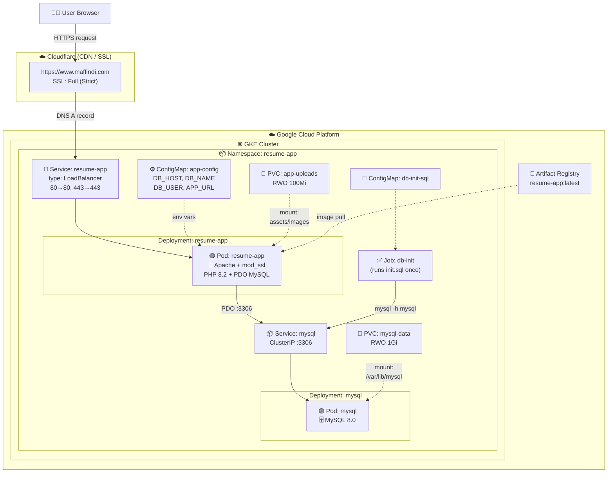
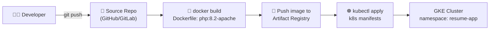
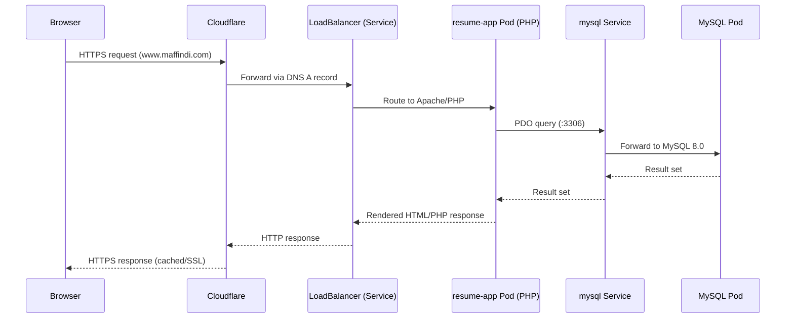
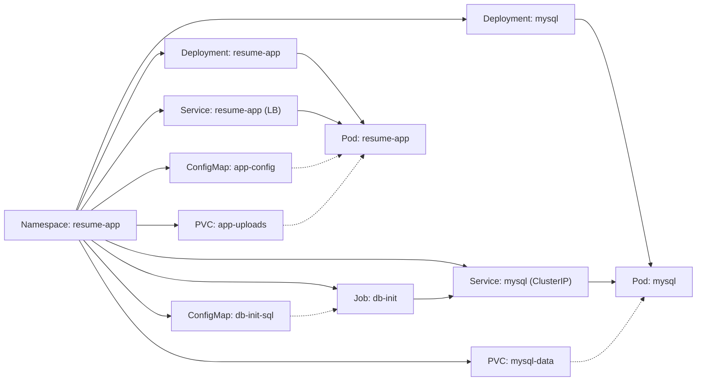

# Online Resume System — Architecture Diagram (Mermaid)

## 1. High-Level System Architecture (GKE Deployment)

## 2. CI/CD & Build Flow

## 3. Application Request Flow (App ↔ Database)

## 4. Kubernetes Resource Relationships

